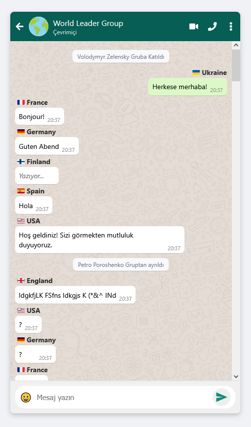

# 🌍 Devlet Başkanlarının Komik Whatsapp Simulasyonu

Bu proje, ReactJS kullanılarak geliştirilmiş eğlenceli bir mesajlaşma simülatörüdür. Dünya liderlerinin grup sohbetini canlandıran bir arayüzle, gelen mesajlara ses efektleri, bayrak simgeleri ve animasyonlu içerikler eşliğinde keyifli bir deneyim sunar.

> Bu uygulama, `Create React App` kullanılarak başlatılmıştır.

## 🚀 Özellikler

- 🌐 Dünya liderleriyle temsili grup sohbeti
- 📩 Otomatik zamanlı mesaj gösterimi
- 📢 Mesaj türüne göre ses efektleri (metin, durum, görsel, silinmiş vs.)
- 🇺🇳 Ülkelere özel bayrak ikonları
- 🎵 Gerçek zamanlı bildirim sesleri
- 💬 Mesaj içinde link desteği
- 📷 Görsel mesaj desteği
- 📱 Mobil WhatsApp benzeri arayüz

## 📂 Proje Yapısı

├── public/ 
├── src/ 
├── assets/ 
# Görsel ve ses dosyaları 
├── messages.js 
# Örnek mesaj verileri 
├── App.js 
# Ana uygulama bileşeni 
├── App.css 
# Özel stil dosyası 
└── ... 
├── package.json 
└── README.md

## 🧑‍💻 Geliştirici Komutları

Aşağıdaki komutları terminalde kullanarak projeyi çalıştırabilir ya da build alabilirsiniz:

### `npm install`

Gerekli tüm bağımlılıkları yükler.

### `npm start`

Uygulamayı geliştirme modunda başlatır.\
[http://localhost:3000](http://localhost:3000) adresinden uygulamayı görüntüleyebilirsiniz.

### `npm run build`

Uygulamayı production (yayın) modunda derler.\
`build/` klasörü altında optimize edilmiş çıktıyı oluşturur.

## 🔊 Ses Bildirimleri

Uygulamada kullanılan bildirim sesleri:

- `text.mp3` → Yeni metin mesajı
- `status.mp3` → Durum mesajı
- `iphone.mp3` → Görsel mesaj bildirimi
- `deleted.mp3` → Silinmiş mesaj bildirimi
- `vibro.mp3` → Yazıyor... animasyonu için

## 📦 Kullanılan Kütüphaneler

- [React Icons](https://react-icons.github.io/react-icons/) – simgeler
- [Create React App](https://create-react-app.dev/) – proje kurulumu

## 🎯 Geliştirici Notları

Bu proje bir mesajlaşma uygulaması değildir, sadece simülasyon amaçlıdır. Kod yapısı, animasyon ve UI örnekleriyle React geliştirme pratiği için uygundur.

## 📸 Ekran Görüntüsü

## 📃 Lisans

MIT © 2025

---

> Eğlenceli bir grup sohbet deneyimi için arkanıza yaslanın ve gelen mesajları izleyin! 🎬
